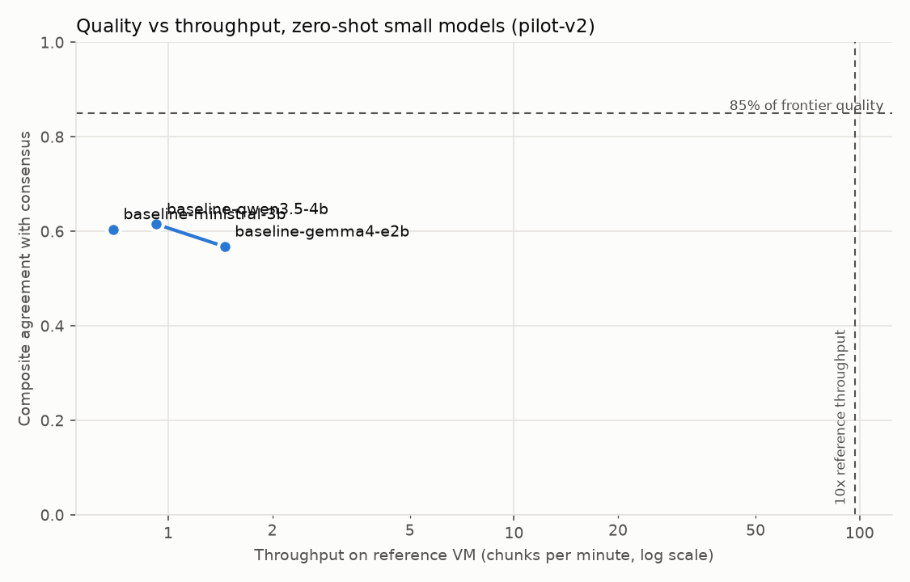

# Pilot report: pilot-v2

All quality numbers in this report measure **agreement with frontier reference models** (Claude and a GPT mini-tier model). They are not a comparison against human ground truth.

## 1. Decision

**RETHINK** (criteria criteria-v1, decided on the holdout split, reruns so far: 1).

Path through the decision table (FR-030):

- after 1 rerun(s), ['item_matching'] still miss their thresholds on the holdout split -> rethink (no further rerun)

| Dimension | Score | Threshold | Decision |
|---|---|---|---|
| Relevance | 0.839 | 0.800 | go |
| Item matching | 0.593 | 0.700 | rethink |
| Kind | 0.826 | 0.600 | go |
| Actor type | 0.775 | 0.600 | go |
| Evidence type | 0.667 | 0.600 | go |
| Evidence scope | 0.609 | 0.600 | go |

Fine-tuning (FR-031): **required**. Rule: quality_ratio_a >= 0.85 and throughput_ratio >= 10.0 (throughput against the GPT mini-tier reference, which makes the 10x hurdle stricter than against a flagship).

Main-split agreement after the rerun (optimistic, because the revisions were derived from these chunks): Relevance 0.878, Item matching 0.547, Kind 0.743, Actor type 0.730, Evidence type 0.615, Evidence scope 0.618

## 2. Versions

- Benchmark version: `pilot-v2` (state frozen, frozen 2026-10-06T11:53:48.644863+00:00)
- Guideline sha256: `6b5662fa77e02fba`
- Criteria sha256: `f778d0d46cf0a93e`
- Reference runs: `run-reference-claude-reference-main-6b5662fa`, `run-reference-gpt-mini-reference-main-6b5662fa`

## 3. Corpus composition

- main: composition not validated in this benchmark version

- holdout: composition not validated in this benchmark version

## 4. Agreement between reference models

150 chunks, excluded: 0, invalid quotes per run: {'run-reference-claude-reference-main-6b5662fa': 20, 'run-reference-gpt-mini-reference-main-6b5662fa': 204}.

| Dimension | Metric | Score | 95% CI | n | Underpowered |
|---|---|---|---|---|---|
| Relevance | kappa | 0.878 | 0.707 to 1.000 | 150 | no |
| Item matching | f1 | 0.547 | 0.512 to 0.582 | 1842 | no |
| Kind | kappa | 0.743 | 0.689 to 0.800 | 694 | no |
| Actor type | kappa | 0.730 | 0.668 to 0.779 | 694 | no |
| Evidence type | quadratic_weighted_kappa | 0.615 | 0.494 to 0.720 | 694 | no |
| Evidence scope | kappa | 0.618 | 0.553 to 0.678 | 694 | no |

Evidence type, linear weighting: 0.577. Composite (all units): 0.689.

Evidence levels in the consensus: opinion 281, anecdote 81, routine 14, observation 68, measurement 40.

Breakdowns (score / n):

| language | Relevance | Item matching | Kind | Actor type | Evidence type | Evidence scope |
|---|---|---|---|---|---|---|
| de | 0.863 / 92 | 0.512 / 1144 | 0.783 / 394 | 0.732 / 394 | 0.606 / 394 | 0.586 / 394 |
| en | 0.900 / 58 | 0.601 / 698 | 0.691 / 300 | 0.724 / 300 | 0.581 / 300 | 0.640 / 300 |

| source_type | Relevance | Item matching | Kind | Actor type | Evidence type | Evidence scope |
|---|---|---|---|---|---|---|
| forum_review | 0.795 / 60 | 0.546 / 842 | 0.832 / 316 | 0.719 / 316 | 0.513 / 316 | 0.592 / 316 |
| paper | 1.000 / 45 | 0.583 / 384 | 0.685 / 158 | 0.733 / 158 | 0.720 / 158 | 0.698 / 158 |
| transcript | 1.000 / 45 | 0.526 / 616 | 0.655 / 220 | 0.648 / 220 | 0.350 / 220 | 0.563 / 220 |

| region | Relevance | Item matching | Kind | Actor type | Evidence type | Evidence scope |
|---|---|---|---|---|---|---|
| EU | 0.857 / 129 | 0.526 / 1479 | 0.757 / 528 | 0.729 / 528 | 0.681 / 528 | 0.595 / 528 |
| non_EU | 1.000 / 21 | 0.628 / 363 | 0.699 / 166 | 0.696 / 166 | 0.458 / 166 | 0.677 / 166 |

## 5. Deterministic checks

| Run | Check | Pass rate | n |
|---|---|---|---|
| run-baseline-baseline-gemma4-e2b-main-6b5662fa | consistency.enum_values | 1.000 | 1162 |
| run-baseline-baseline-gemma4-e2b-main-6b5662fa | consistency.irrelevant_no_items | 1.000 | 150 |
| run-baseline-baseline-gemma4-e2b-main-6b5662fa | consistency.quantified_has_quantity | 0.958 | 120 |
| run-baseline-baseline-gemma4-e2b-main-6b5662fa | quote_verbatim | 0.803 | 1162 |
| run-baseline-baseline-gemma4-e2b-main-6b5662fa | schema_valid | 1.000 | 150 |
| run-baseline-baseline-gemma4-e4b-main-6b5662fa | consistency.enum_values | 1.000 | 1493 |
| run-baseline-baseline-gemma4-e4b-main-6b5662fa | consistency.irrelevant_no_items | 1.000 | 150 |
| run-baseline-baseline-gemma4-e4b-main-6b5662fa | consistency.quantified_has_quantity | 0.942 | 207 |
| run-baseline-baseline-gemma4-e4b-main-6b5662fa | quote_verbatim | 0.823 | 1493 |
| run-baseline-baseline-gemma4-e4b-main-6b5662fa | schema_valid | 1.000 | 150 |
| run-baseline-baseline-ministral-3b-main-6b5662fa | consistency.enum_values | 1.000 | 1276 |
| run-baseline-baseline-ministral-3b-main-6b5662fa | consistency.irrelevant_no_items | 1.000 | 150 |
| run-baseline-baseline-ministral-3b-main-6b5662fa | consistency.quantified_has_quantity | 0.932 | 133 |
| run-baseline-baseline-ministral-3b-main-6b5662fa | quote_verbatim | 0.590 | 1276 |
| run-baseline-baseline-ministral-3b-main-6b5662fa | schema_valid | 1.000 | 150 |
| run-baseline-baseline-qwen3.5-4b-main-6b5662fa | consistency.enum_values | 1.000 | 1114 |
| run-baseline-baseline-qwen3.5-4b-main-6b5662fa | consistency.irrelevant_no_items | 1.000 | 149 |
| run-baseline-baseline-qwen3.5-4b-main-6b5662fa | consistency.quantified_has_quantity | 0.827 | 156 |
| run-baseline-baseline-qwen3.5-4b-main-6b5662fa | quote_verbatim | 0.736 | 1114 |
| run-baseline-baseline-qwen3.5-4b-main-6b5662fa | schema_valid | 0.993 | 150 |
| run-reference-claude-reference-holdout-6b5662fa | consistency.enum_values | 1.000 | 309 |
| run-reference-claude-reference-holdout-6b5662fa | consistency.irrelevant_no_items | 1.000 | 30 |
| run-reference-claude-reference-holdout-6b5662fa | consistency.quantified_has_quantity | 0.982 | 57 |
| run-reference-claude-reference-holdout-6b5662fa | quote_verbatim | 0.984 | 309 |
| run-reference-claude-reference-holdout-6b5662fa | schema_valid | 1.000 | 30 |
| run-reference-claude-reference-main-6b5662fa | consistency.enum_values | 1.000 | 1412 |
| run-reference-claude-reference-main-6b5662fa | consistency.irrelevant_no_items | 1.000 | 150 |
| run-reference-claude-reference-main-6b5662fa | consistency.quantified_has_quantity | 0.961 | 283 |
| run-reference-claude-reference-main-6b5662fa | quote_verbatim | 0.986 | 1412 |
| run-reference-claude-reference-main-6b5662fa | schema_valid | 1.000 | 150 |
| run-reference-gpt-mini-reference-holdout-6b5662fa | consistency.enum_values | 1.000 | 312 |
| run-reference-gpt-mini-reference-holdout-6b5662fa | consistency.irrelevant_no_items | 1.000 | 30 |
| run-reference-gpt-mini-reference-holdout-6b5662fa | consistency.quantified_has_quantity | 0.846 | 39 |
| run-reference-gpt-mini-reference-holdout-6b5662fa | quote_verbatim | 0.830 | 312 |
| run-reference-gpt-mini-reference-holdout-6b5662fa | schema_valid | 1.000 | 30 |
| run-reference-gpt-mini-reference-main-6b5662fa | consistency.enum_values | 1.000 | 1348 |
| run-reference-gpt-mini-reference-main-6b5662fa | consistency.irrelevant_no_items | 1.000 | 150 |
| run-reference-gpt-mini-reference-main-6b5662fa | consistency.quantified_has_quantity | 0.909 | 165 |
| run-reference-gpt-mini-reference-main-6b5662fa | quote_verbatim | 0.849 | 1348 |
| run-reference-gpt-mini-reference-main-6b5662fa | schema_valid | 1.000 | 150 |
| run-teacher_candidate-teacher-ensemble-main-6b5662fa | consistency.enum_values | 1.000 | 1488 |
| run-teacher_candidate-teacher-ensemble-main-6b5662fa | consistency.irrelevant_no_items | 1.000 | 150 |
| run-teacher_candidate-teacher-ensemble-main-6b5662fa | consistency.quantified_has_quantity | 0.914 | 244 |
| run-teacher_candidate-teacher-ensemble-main-6b5662fa | quote_verbatim | 1.000 | 1488 |
| run-teacher_candidate-teacher-ensemble-main-6b5662fa | schema_valid | 1.000 | 150 |
| run-teacher_candidate-teacher-or-deepseek-v4.1-flash-main-6b5662fa | consistency.enum_values | 1.000 | 1600 |
| run-teacher_candidate-teacher-or-deepseek-v4.1-flash-main-6b5662fa | consistency.irrelevant_no_items | 1.000 | 139 |
| run-teacher_candidate-teacher-or-deepseek-v4.1-flash-main-6b5662fa | consistency.quantified_has_quantity | 0.927 | 273 |
| run-teacher_candidate-teacher-or-deepseek-v4.1-flash-main-6b5662fa | quote_verbatim | 0.930 | 1600 |
| run-teacher_candidate-teacher-or-deepseek-v4.1-flash-main-6b5662fa | schema_valid | 0.927 | 150 |
| run-teacher_candidate-teacher-or-glm-5.3-flash-main-6b5662fa | consistency.irrelevant_no_items | 1.000 | 18 |
| run-teacher_candidate-teacher-or-glm-5.3-flash-main-6b5662fa | schema_valid | 0.120 | 150 |
| run-teacher_candidate-teacher-or-mimo-v2.6-pro-main-6b5662fa | consistency.enum_values | 1.000 | 1758 |
| run-teacher_candidate-teacher-or-mimo-v2.6-pro-main-6b5662fa | consistency.irrelevant_no_items | 1.000 | 150 |
| run-teacher_candidate-teacher-or-mimo-v2.6-pro-main-6b5662fa | consistency.quantified_has_quantity | 0.913 | 252 |
| run-teacher_candidate-teacher-or-mimo-v2.6-pro-main-6b5662fa | quote_verbatim | 0.879 | 1758 |
| run-teacher_candidate-teacher-or-mimo-v2.6-pro-main-6b5662fa | schema_valid | 1.000 | 150 |
| run-teacher_candidate-teacher-qwen3.8-main-6b5662fa | consistency.enum_values | 1.000 | 1210 |
| run-teacher_candidate-teacher-qwen3.8-main-6b5662fa | consistency.irrelevant_no_items | 1.000 | 150 |
| run-teacher_candidate-teacher-qwen3.8-main-6b5662fa | consistency.quantified_has_quantity | 0.950 | 201 |
| run-teacher_candidate-teacher-qwen3.8-main-6b5662fa | quote_verbatim | 0.868 | 1210 |
| run-teacher_candidate-teacher-qwen3.8-main-6b5662fa | schema_valid | 1.000 | 150 |

## 6. Contested items

1574 contested entries, kept separately from the consensus: actor_type 112, evidence_scope 156, evidence_type 210, item_existence 1148, kind 105, relevance 3.

## 7. Disagreement categories

**1574 contested entries are not categorized yet** (SC-004).

## 8. Proposed guideline revisions

No revisions file (`revisions.md`) yet.

## 9. Teacher candidates and zero-shot baselines

| Model | Role | Relevance | Item matching | Kind | Actor type | Evidence type | Evidence scope | Composite | Ratio a | Ratio b | Chunks/min (VM) | p95 ms | Peak RSS MB |
|---|---|---|---|---|---|---|---|---|---|---|---|---|---|
| baseline-gemma4-e2b | baseline | 0.479 | 0.527 | 0.713 | 0.612 | 0.424 | 0.653 | 0.568 | 0.568 | 0.825 | 1.456 | 72060.071 | 5495.400 |
| baseline-gemma4-e4b | baseline | 0.679 | 0.638 | 0.814 | 0.701 | 0.398 | 0.772 | 0.667 | 0.667 | 0.969 | n/a | n/a | n/a |
| baseline-ministral-3b | baseline | 0.530 | 0.457 | 0.725 | 0.735 | 0.684 | 0.495 | 0.604 | 0.604 | 0.878 | 0.693 | 137400.408 | 4900.000 |
| baseline-qwen3.5-4b | baseline | 0.527 | 0.526 | 0.729 | 0.611 | 0.836 | 0.463 | 0.615 | 0.615 | 0.893 | 0.925 | 128599.887 | 4411.500 |
| teacher-ensemble | teacher_candidate | 1.000 | 0.779 | 0.922 | 0.949 | 0.944 | 0.909 | 0.917 | 0.917 | 1.332 | n/a | n/a | n/a |
| teacher-or-deepseek-v4.1-flash | teacher_candidate | 0.658 | 0.700 | 0.919 | 0.944 | 0.916 | 0.877 | 0.836 | 0.836 | 1.214 | n/a | n/a | n/a |
| teacher-or-glm-5.3-flash | teacher_candidate | 0.079 | 0.000 | n/a | n/a | n/a | n/a | 0.039 | 0.039 | 0.057 | n/a | n/a | n/a |
| teacher-or-mimo-v2.6-pro | teacher_candidate | 1.000 | 0.736 | 0.921 | 0.949 | 0.967 | 0.884 | 0.909 | 0.909 | 1.321 | n/a | n/a | n/a |
| teacher-qwen3.8 | teacher_candidate | 0.916 | 0.767 | 0.906 | 0.913 | 0.936 | 0.905 | 0.890 | 0.890 | 1.293 | n/a | n/a | n/a |

### Teacher fitness (FR-031a)

| Teacher | Composite (raw) | Composite (repaired) | Ratio a (repaired) | Schema valid | Quote verbatim (raw) | Repaired / dropped quotes | EUR per chunk | FR-031a |
|---|---|---|---|---|---|---|---|---|
| teacher-ensemble | 0.917 | 0.917 | 0.917 | 1.000 | 1.000 | 0 / 0 | 0.025 | fit |
| teacher-or-deepseek-v4.1-flash | 0.836 | 0.833 | 0.833 | 0.927 | 0.930 | 109 / 3 | 0.016 | not fit |
| teacher-or-glm-5.3-flash | 0.039 | 0.039 | 0.039 | 0.120 | n/a | 0 / 0 | 0.006 | not fit |
| teacher-or-mimo-v2.6-pro | 0.909 | 0.905 | 0.905 | 1.000 | 0.879 | 207 / 5 | 0.004 | fit |
| teacher-qwen3.8 | 0.890 | 0.885 | 0.885 | 1.000 | 0.868 | 154 / 6 | 0.000 | not fit |

Rule: fit if the repaired composite reaches quality_ratio_a >= 0.9 (against the frontier-vs-frontier composite on consensus units) and schema_valid >= 0.98; among fit candidates the highest repaired composite is recommended, and within 0.02 of it the lowest cost per chunk.
Recommended teacher: **teacher-or-mimo-v2.6-pro**.
- `teacher-or-deepseek-v4.1-flash` misses: repaired quality_ratio_a 0.833 < 0.9; relevance 0.658 < 0.9 x frontier 1.000; item_matching 0.687 < 0.9 x frontier 1.000; evidence_scope 0.874 < 0.9 x frontier 1.000; schema_valid 0.927 < 0.98
- `teacher-or-glm-5.3-flash` misses: repaired quality_ratio_a 0.039 < 0.9; relevance 0.079 < 0.9 x frontier 1.000; item_matching 0.000 < 0.9 x frontier 1.000; kind n/a < 0.9 x frontier 1.000; actor_type n/a < 0.9 x frontier 1.000; evidence_type n/a < 0.9 x frontier 1.000; evidence_scope n/a < 0.9 x frontier 1.000; schema_valid 0.120 < 0.98
- `teacher-qwen3.8` misses: repaired quality_ratio_a 0.885 < 0.9; item_matching 0.744 < 0.9 x frontier 1.000

`teacher-ensemble` is the offline ensemble (FR-019b) of `run-teacher_candidate-teacher-or-deepseek-v4.1-flash-main-6b5662fa`, `run-teacher_candidate-teacher-or-glm-5.3-flash-main-6b5662fa`, `run-teacher_candidate-teacher-or-mimo-v2.6-pro-main-6b5662fa`, `run-teacher_candidate-teacher-qwen3.8-main-6b5662fa`; it makes no model calls, and its cost is the sum of its members.

Raw scores and the verbatim check use the outputs as returned; the repaired view replaces near-miss quotes by the source passage (FR-026a), as the training data will. The classification does not change the go/revise/rethink decision.

Contested reference items matched by a model are scored neutrally (FR-028); counts per model: baseline-gemma4-e2b {'evidence_scope': 77, 'evidence_type': 105, 'item_existence': 281, 'kind': 46, 'actor_type': 47, 'relevance': 3}; baseline-gemma4-e4b {'item_existence': 390, 'evidence_scope': 108, 'evidence_type': 154, 'kind': 60, 'actor_type': 72, 'relevance': 3}; baseline-ministral-3b {'evidence_scope': 49, 'evidence_type': 93, 'item_existence': 216, 'actor_type': 50, 'kind': 37, 'relevance': 3}; baseline-qwen3.5-4b {'item_existence': 251, 'evidence_scope': 72, 'evidence_type': 99, 'actor_type': 38, 'kind': 37, 'relevance': 3}; teacher-ensemble {'evidence_scope': 135, 'evidence_type': 188, 'item_existence': 619, 'actor_type': 104, 'kind': 83, 'relevance': 3}; teacher-or-deepseek-v4.1-flash {'evidence_scope': 131, 'evidence_type': 169, 'item_existence': 573, 'actor_type': 86, 'kind': 73, 'relevance': 3}; teacher-or-glm-5.3-flash {'relevance': 3}; teacher-or-mimo-v2.6-pro {'evidence_scope': 138, 'evidence_type': 187, 'item_existence': 599, 'actor_type': 98, 'kind': 85, 'relevance': 3}; teacher-qwen3.8 {'evidence_scope': 113, 'evidence_type': 169, 'item_existence': 383, 'actor_type': 86, 'kind': 65, 'relevance': 3}.

Frontier reference throughput (GPT mini tier, concurrency 1): 9.677 chunks/min. hosted throughput depends on routing and provider rate limits.

## 10. Quality vs throughput

The table in section 9 holds the same values.

## 11. Deviations

- GPT reference is the mini tier of the current generation, not the flagship (budget; plan.md Complexity Tracking, FR-017)
- gpt-mini-reference: no temperature parameter (not supported by the model); provider default sampling
- retried 0 chunks after backend failures
- teacher-or-deepseek-v4.1-flash: provider chosen by OpenRouter per request
- teacher-or-glm-5.3-flash: provider chosen by OpenRouter per request
- teacher-or-mimo-v2.6-pro: provider chosen by OpenRouter per request
- temperature not settable on the Claude subscription CLI path
- user-level ~/.claude/CLAUDE.md may be loaded as context by the CLI
- No manual review (owner decision 2026-10-06): personal data was removed by pattern redaction plus a local model (qwen3.8:27b on the DGX Spark, `jtbd corpus pii-review`), research R7 as amended; the model also redacted some names of public officials, which is stricter than the rule.
- Benchmark chunks were selected by a local model's classification of candidate windows (scripts/pilot/propose_selection.py), not by hand.
- The contested set of pilot-v1 was categorized by the local model qwen3.8:27b (scripts/pilot/categorize_contested.py), not by hand; the free-text sample was not reviewed by a person.
- Reference machine: a Railway service limited to 4 vCPU and 8 GB RAM (AMD EPYC 9655P) instead of a Hetzner CX32; Ollama threads set to the 4 available CPUs (research R6 as amended).
- gemma4:e4b (7.5B parameters) failed under the 8 GB limit (HTTP 500 from the runner) and was replaced by gemma4:e2b for the throughput chart, with its own quality run; e4b keeps its quality score in section 9.
- Baselines run without thinking (`think: false`), like the local teachers, and with the recorded output limit enforced (num_predict); a first qwen3.5:4b run with thinking on reasoned until the context was full and was discarded.
- teacher-or-glm-5.3-flash spent the whole 16,384-token output budget on reasoning in the smoke test (reasoning cannot be disabled or capped on OpenRouter); its full run used max_output_tokens 4096 only to complete the frozen ensemble rule.
- teacher-or-deepseek-v4.1-flash: 11 chunks (7.3%) were schema-invalid; `--retry-failed` retries only backend failures, so they stayed excluded.
- The split balances the non-EU share by swaps within a stratum (both splits meet the composition targets).

## 12. Budget

Spent EUR 9.61 of EUR 20 (OpenRouter EUR 8.11 of the EUR 18.4 key cap).
